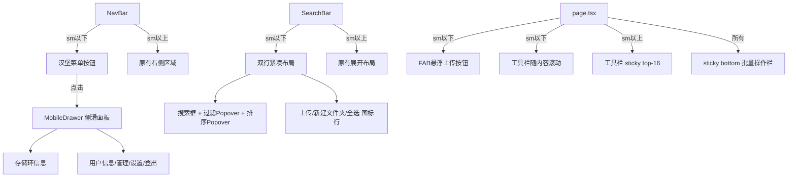

## 产品概述

对 ChamikoFiles 进行全面的响应式 UI 重构，解决小屏端操作按钮折成多行挡住文件列表、导航栏隐藏管理入口等核心问题，实现手机端和电脑端都操作友好的界面。

## 核心功能

### 1. 移动端导航栏改造（nav-bar.tsx）

- 桌面端保持现有布局不变：Logo 左 | 存储环 + 管理员 + 用户 + 登出 + 设置 右
- 移动端（< sm）：Logo 左 | **汉堡菜单按钮** 右（替换被隐藏的 StorageRing/管理员/用户/设置）
- 点击汉堡菜单 → 从右侧滑出抽屉面板，包含：存储环信息、用户名、管理员入口、设置、登出
- 抽屉用 framer-motion 动画 + 半透明遮罩

### 2. 移动端工具栏压缩（search-bar.tsx）

- 桌面端保持现有 6 个类型过滤 + 4 个排序按钮不变
- 移动端（< sm）压缩为：
- 第一行：搜索输入框（flex-1 撑满）+ 类型过滤下拉按钮（显示当前选中类型图标+小点）+ 排序下拉按钮
- 第二行：视图切换 + 上传 + 新建文件夹 + 全选（纯图标按钮，无文字标签）
- 类型过滤下拉和排序下拉用 Popover 弹出面板

### 3. 悬浮上传按钮 FAB（page.tsx）

- 移动端（< sm）：右下角固定悬浮圆形按钮，渐变背景 + Upload 图标
- 点击触发文件选择上传，带微弹动画
- 桌面端隐藏，仍用工具栏内上传按钮

### 4. 工具栏布局调整（page.tsx）

- 移动端取消 `sticky top-16`，工具栏随内容滚动（节省垂直空间）
- 工具栏背景从 `bg-surface-dark/80` 降为透明（不需要 sticky 效果）
- 批量操作栏从 `fixed bottom-6` 改为 `sticky bottom-4`（随页面滚动，避免遮住内容）

### 5. 文件卡片紧凑化（file-card.tsx）

- 移动端（< sm）：`p-2.5` 替代 `p-3.5`，预览区图标从 `w-16 h-16` 缩至 `w-12 h-12`，文字 `text-xs`
- 网格间距从 `gap-4` 缩至 `gap-2`

### 6. Toast 通知窄屏适配（toast-provider.tsx）

- 移动端 `right-4 left-4`（左右各留16px），`min-w-0` 取消最小宽度限制

### 7. 全局样式增强（globals.css）

- 抽屉遮罩动画、FAB 浮动动画
- 隐藏式滚动条样式复用

## 技术栈

- **框架**: Next.js 14 (App Router) + React 18 + TypeScript
- **样式**: Tailwind CSS（断点 sm:640px, md:768px, lg:1024px）
- **动画**: Framer Motion (AnimatePresence, motion.div)
- **图标**: lucide-react
- **持久化**: 视图模式/排序偏好 localStorage

## 实现方案

### 整体策略

**桌面优先 + 移动端覆盖**：所有新样式通过 `{base} sm:{override}` 模式编写，保持桌面端原样不动，移动端叠加新样式。这样最安全，不会破坏现有桌面体验。

### 移动端抽屉面板（mobile-drawer.tsx）

- 独立客户端组件，接收 `open` + `onClose` props
- 使用 `AnimatePresence` 包裹两层：
- 外层 `motion.div`：半透明黑色遮罩（`bg-black/60`），点击关闭
- 内层 `motion.div`：右侧滑入面板（`w-72`, `h-full`, `fixed right-0 top-0`），`initial={{ x: "100%" }} animate={{ x: 0 }} exit={{ x: "100%" }}`
- 面板内容布局：顶部关闭按钮 → 存储环信息 → 分割线 → 用户名+头像 → 管理员入口 → 设置 → 分割线 → 登出按钮
- 使用 `useScrollLock(true)` 在打开时锁定背景滚动

### 移动端紧凑工具栏（search-bar.tsx）

改造思路：不改组件接口，仅改变渲染布局。在 `< sm` 断点：

- 用 `flex flex-col gap-2` 替代 `flex flex-wrap gap-3`
- 第一行：搜索框（`flex-1`） + 过滤选择器（弹出面板） + 排序选择器（弹出面板）
- 第二行：`flex items-center gap-1.5`，纯图标按钮（上传/新建文件夹/全选/视图切换）
- 弹出面板用 `absolute` 定位的 glass-card，点击外部关闭

类型过滤弹窗内容：6 个筛选选项的垂直列表，每个带图标+文字
排序弹窗内容：4 个排序选项的垂直列表，当前选中高亮+升降序指示

### FAB 悬浮按钮

位于 page.tsx，`fixed bottom-6 right-4 sm:hidden z-50`：

- `w-14 h-14 rounded-2xl bg-gradient-to-br from-primary to-primary-cyan shadow-lg shadow-primary/30`
- 点击触发 `<input type="file" hidden>` 
- `whileTap={{ scale: 0.9 }}` 点击反馈

### 工具栏取消 Sticky

page.tsx 中工具栏外层 div：

- 从 `sticky top-16 z-40` 改为 `sm:sticky sm:top-16 sm:z-40`
- 从 `bg-surface-dark/80 backdrop-blur-lg` 改为 `sm:bg-surface-dark/80 sm:backdrop-blur-lg`
- 负 margin 只保留 sm 及以上：`-mx-4 sm:-mx-6 lg:-mx-8` → 移动端自然流动

### 批量操作栏适配

从 `fixed bottom-6` 改为 `fixed bottom-6 sm:bottom-6`（移动端离底部更远避开 FAB）→ 实际改为 `sticky bottom-4`，跟随页面自然流动不被 FAB 遮挡

### 文件卡片紧凑化

在 file-card.tsx 中，所有间距使用响应式类名：

- 外层 padding：`p-2.5 sm:p-3.5`
- 预览区图标容器：`w-12 h-12 sm:w-16 sm:h-16`，图标 `size={28} sm:size={32}`
- 文件名：`text-xs sm:text-sm`
- 信息行：`text-[10px] sm:text-xs`

### Toast 适配

toast-provider 定位从 `fixed top-6 right-6` 改为 `fixed top-4 sm:top-6 right-4 sm:right-6 left-4 sm:left-auto`，宽度 `max-w-[calc(100vw-32px)] sm:min-w-[320px]`

## 目录结构

```
src/
├── components/
│   ├── mobile-drawer.tsx        # [NEW] 移动端侧滑抽屉面板
│   ├── nav-bar.tsx              # [MODIFY] 加汉堡按钮触发抽屉
│   ├── search-bar.tsx           # [MODIFY] 响应式压缩为双行+下拉
│   ├── file-card.tsx            # [MODIFY] 紧凑间距响应式
│   ├── toast-provider.tsx       # [MODIFY] 窄屏适配
│   └── view-toggle.tsx          # [UNCHANGED]
├── app/
│   ├── page.tsx                 # [MODIFY] FAB + 取消sticky + 批量栏
│   ├── layout.tsx               # [UNCHANGED]
│   └── globals.css              # [MODIFY] FAB/抽屉动画
```

## 架构设计



## 实现细节

### 性能注意事项

- MobileDrawer 使用 `AnimatePresence` 确保关闭时 DOM 移除，不残留
- 过滤/排序 Popover 使用 `useRef` + `useEffect` 监听外部点击关闭
- FAB 用 `position: fixed` 避免频繁重排

### 向后兼容

- 所有修改均通过断点响应式实现，桌面端（>= sm）表现与当前完全一致
- 组件接口不变，只是内部渲染逻辑增加响应式分支