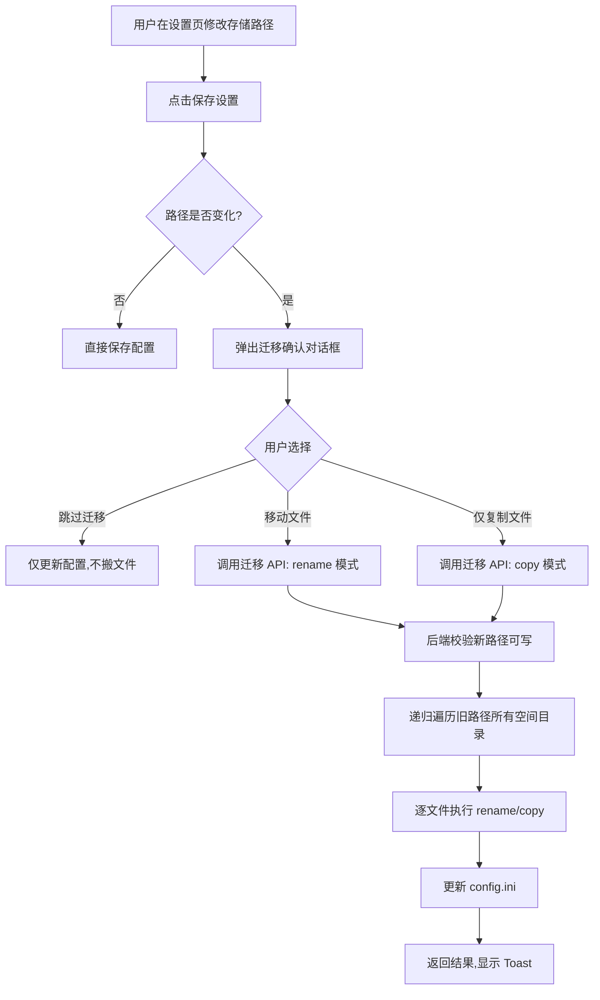

## 用户需求

设置页面的"存储路径"目前不生效——修改后文件仍保存到项目目录下的 `data/storage_base/`。需要让存储路径真正可用，并在修改路径时提供文件迁移功能。

## 核心功能

### 1. 存储路径动态化

- 将硬编码的 `data/storage_base/` 改为从 `config.ini` 的 `storage.path` 动态读取
- 默认存储路径改为 `uploads/`（项目根目录下），更直观
- 所有文件操作（上传、下载、移动、重命名、删除等）统一使用配置中的路径

### 2. 保存时路径变更检测

- 点击"保存设置"时，检测存储路径是否发生变化
- 如果路径没变，直接保存（原有行为）
- 如果路径变了，弹出迁移确认对话框

### 3. 迁移确认对话框

对话框包含以下选项：

- **跳过迁移**：只切换存储路径，已有文件保留在原位不动，之后上传的新文件存到新路径
- **执行迁移**：将旧路径下所有文件搬到新路径，并提供两种搬运方式：
- **移动文件**（推荐）：使用文件系统移动操作（rename），速度快，不占双倍磁盘空间
- **仅复制文件**：复制文件到新路径，旧文件保留不删，更安全但占用双倍空间
- 迁移过程中显示进度提示
- 迁移完成后自动保存新配置

### 4. 安全校验

- 新路径有效性检查（目录是否存在/可创建、是否有写入权限）
- 路径穿越防护
- 迁移过程错误处理和回滚提示

## 技术栈

- 后端：Next.js 14 API Routes（Node.js Runtime）
- 前端：React 18 + TypeScript + Tailwind CSS + Framer Motion
- 文件系统：Node.js `fs` 模块（`renameSync`、`copyFileSync`、`mkdirSync` 等）
- 配置管理：自研 INI 解析器（`src/lib/config.ts`）

## 实现方案

### 核心策略

**将 `STORAGE_BASE` 从硬编码常量改为动态函数 `getStorageBase()`**，该函数从 `config.ini` 读取路径。所有调用 `STORAGE_BASE` 的地方改为调用 `getStorageBase()`。

**保存设置时分两阶段**：

1. 前端 `handleSave` 检测路径是否变化，若变化则先调 `PUT /api/config` 获取旧路径信息（但不真正写入）
2. 弹出迁移对话框，用户选择迁移策略
3. 根据选择调 `POST /api/storage/migrate` 执行迁移
4. 迁移完成后再次调 `PUT /api/config`（带 `skipMigration: true`）写入新配置

实际上更好的做法是：

1. 前端检测路径变化后，弹出对话框
2. 用户确认后，一次性发送请求到后端（包含新配置 + 迁移选项）
3. 后端在同一请求中完成：校验新路径 → 迁移文件 → 更新配置

### 关键设计决策

**为什么用 `getStorageBase()` 函数而非修改常量**：`file-utils-server.ts` 中的 `STORAGE_BASE` 在模块顶层定义，初始化时 `config.ini` 可能还未就绪。改为惰性函数可避免启动顺序问题。

**为什么在同一个 API 请求中完成迁移+保存**：保证原子性——如果迁移失败，配置也不会被更新，避免出现"路径切了但文件没搬过去"的半吊子状态。

**移动 vs 复制**：移动使用 `fs.renameSync`，在同一磁盘分区时是元数据操作，O(1) 时间复杂度；跨分区时系统会自动退化为复制+删除。复制使用递归 `fs.copyFileSync`，适合用户希望保留原文件的场景。

### 迁移流程



## 实现细节

### 性能考虑

- 迁移 API 使用同步文件操作（`fs.renameSync`/`fs.copyFileSync`），避免大量异步 Promise 堆积
- 大文件迁移时前端显示 loading 状态，超时时间设置较长（5分钟）
- `getStorageBase()` 结果可考虑简单缓存，但每次文件操作都重新读取以保证配置热更新

### 错误处理

- 新路径不可写：提前返回错误，不执行迁移
- 迁移过程中单个文件失败：记录错误但继续处理其余文件，最后汇总报告
- 迁移完成但配置写入失败：回滚配置（保留旧路径），已迁移的文件保留在新路径

### 向后兼容

- 默认路径从 `data/storage_base/` 改为 `uploads/`，首次启动时 `config.ini` 不存在会自动创建含新默认值的配置
- 已有 `config.ini` 的用户不受影响，`storage.path` 仍保留旧值
- `data/storage_base/` 目录结构保持不变，迁移功能可将其内容搬到新路径

## 目录结构

```
src/
├── lib/
│   ├── file-utils-server.ts    # [MODIFY] STORAGE_BASE 改为 getStorageBase() 函数，从 config 动态读取
│   └── config.ts               # [MODIFY] getDefaultConfig() 中 path 改为 "uploads/"
├── app/
│   ├── api/
│   │   ├── config/
│   │   │   └── route.ts        # [MODIFY] PUT 端点：检测路径变化，支持带迁移选项的保存请求
│   │   ├── files/
│   │   │   └── folders/
│   │   │       └── route.ts    # [MODIFY] 改为使用 getStorageBase() 而非 config.storage.path
│   │   └── storage/
│   │       └── migrate/
│   │           └── route.ts    # [NEW] POST 端点：执行文件迁移（移动或复制）
│   └── settings/
│       └── page.tsx            # [MODIFY] 保存时检测路径变化，集成迁移对话框
└── components/
    └── storage-migrate-dialog.tsx  # [NEW] 迁移确认对话框组件
config.ini                       # [MODIFY] 默认 path 改为 uploads/
```

## 关键代码结构

### getStorageBase() 函数签名

```ts
// src/lib/file-utils-server.ts
export function getStorageBase(): string {
  const config = readConfig();
  return path.resolve(process.cwd(), config.storage.path || "uploads");
}
```

### 迁移 API 请求体

```ts
interface MigrateRequest {
  oldPath: string;       // 旧存储根路径
  newPath: string;       // 新存储根路径
  mode: "move" | "copy"; // 迁移模式
}

interface MigrateResponse {
  success: boolean;
  data: {
    totalFiles: number;
    migratedFiles: number;
    failedFiles: number;
    errors: string[];    // 失败文件列表
  };
}
```

## 迁移确认对话框设计

采用与项目现有 `MoveDialog` 一致的玻璃拟态风格（glass-card + backdrop-blur），使用 Framer Motion 动画。

### 对话框布局（从上到下）

**标题区**：图标（FolderSync 或 ArrowRightLeft）+ "更改存储路径"标题 + 副标题显示新旧路径对比

**说明区**：简短说明文字，告知用户检测到存储路径变更，已有文件需要处理

**选项区**（三选一的 Radio 风格卡片）：

- **跳过迁移**：灰色卡片，图标 SkipForward，"仅切换路径，已有文件保留在原位不动"
- **移动文件（推荐）**：高亮边框（primary 色），图标 Move，"直接移动文件到新路径，速度快，不占额外空间" + 绿色"推荐"标签
- **仅复制文件**：普通卡片，图标 Copy，"复制文件到新路径，原文件保留，更安全但占用双倍空间"

**底部按钮区**：取消按钮 + 确认按钮（按钮文字随选项变化："跳过并保存" / "移动并保存" / "复制并保存"）

### 状态

- 默认：三选一，默认选中"移动文件（推荐）"
- 迁移中：显示加载动画 + "正在迁移文件..." 文字，按钮禁用
- 迁移完成：自动关闭对话框，Toast 提示结果