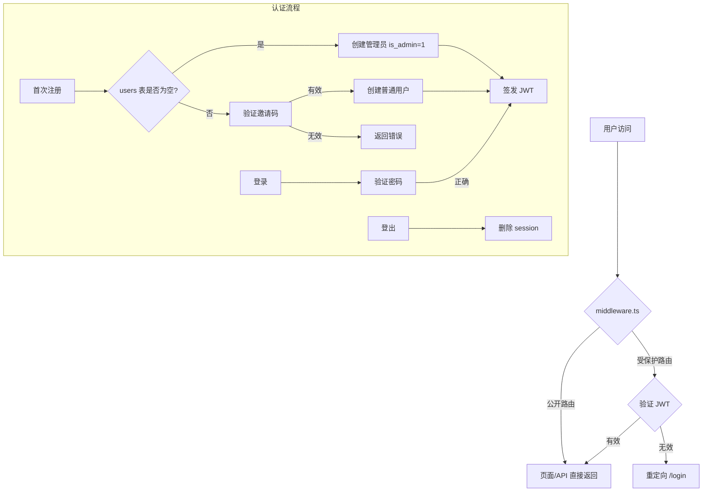

## 用户需求

从零为 ChamikoFiles 建成完整的用户权限体系，实现从访客到管理员的访问控制闭环：

1. **首次初始化自动置管**：首个注册用户直接被赋为系统唯一管理员，禁止创建第二个管理员
2. **邀请码准入制**：后继注册必须经由管理员生成的专属邀请码，一码一人、即时核销
3. **邀请码生命周期控制**：管理员每次生成新邀请码时旧码自动核销，设置 24 小时有效期，注册成功即核销
4. **管理员专属控制台**：可生成/查看邀请码，展示当前全部注册用户列表
5. **安全认证机制**：JWT 签发认证、httpOnly cookie 存储、route middleware 全局守护
6. **无感用户体验**：现有网盘业务零侵入，从注册到登录到文件访问形成流畅闭环

## 技术选型

- **数据库**：better-sqlite3 — 零配置、免安装、同步操作，无需任何外部服务。数据文件放置在项目根目录 `data/chamiko.db`，与现有文件型存储风格一致
- **密码哈希**：bcryptjs — 纯 JS 实现，无 C++ 编译依赖，Windows 下稳定可靠
- **认证令牌**：jose — JWT 签发/验证，支持 Web Crypto API，兼容 Next.js Edge Runtime，为未来 Edge 部署留有空间
- **Cookie 存储**：httpOnly + secure + sameSite=lax，JWT 存储在 httpOnly cookie 中，防止 XSS 攻击

## 实现方案

### 整体架构

```
请求进入 → Middleware（鉴权/放行） → API Route → db/auth 工具层 → SQLite 文件
```

### 数据流



### 中间件路由策略

`middleware.ts` 按白名单/黑名单模式运行：

- **白名单（放行）**：`/api/auth/*`、`/login`、`/register`、`/_next/*`、`/favicon.ico`
- **黑名单以外的所有路由（拦截）**：`/` 主页、`/api/files/*`、`/api/config`、`/api/storage`、`/api/admin/*`
- 拦截时验证 cookie 中 JWT 有效性，无效则重定向到 `/login`

### 页面路由设计

| 路由 | 功能 | 访问权限 |
| --- | --- | --- |
| `/login` | 登录页 | 公开 |
| `/register` | 注册页（自动检测首次/非首次） | 公开 |
| `/` | 网盘主页（现有功能完整保留） | 需登录 |
| `/admin` | 管理员控制台 | 仅管理员 |


### 数据库事务安全

- 注册时**原子操作**：验证邀请码→创建用户→核销邀请码 三步在同一事务中完成
- 生成新邀请码时：更新旧邀请码为失效 + 插入新邀请码 在同一事务中完成
- SQLite WAL 模式：开启 WAL 日志，提升并发读性能

## 实现注意事项

- **现有 API 零修改**：所有 `/api/files/*` 路由完全不改代码，由 middleware 统一拦截未认证请求
- **NavBar 增强而非重写**：只在现有 NavBar 右侧添加用户头像+管理入口+登出按钮，其余不变
- **数据库文件首次自动创建**：`getDb()` 函数检测 `data/chamiko.db` 不存在时自动创建表结构
- **无状态设计**：JWT 只验证签名与过期时间，不依赖服务端会话查找；登出通过删除 cookie + 记录失效 token hash 实现
- **密码安全**：bcrypt salt rounds 设为 12，平衡安全与性能

## 设计风格

完全延续现有 ChamikoFiles 暗色主题设计语言：深紫色/靛蓝基调配色，毛玻璃卡片效果，底部光晕背景，自定义滚动条。登录/注册页采用居中悬浮卡片布局，与预览弹窗风格一致，圆润边框与半透明效果。

## 登录页面

- 全屏深色背景 + 径向渐变光晕（复用现有 body::before 效果）
- 居中玻璃卡片：品牌色渐变标题 "ChamikoFiles"，下方表单区域
- 输入框：暗色半透明背景，聚焦时靛蓝发光边框
- 登录按钮：brand 渐变色，hover 时亮度提升
- 底部链接："还没有账号？立即注册" → 跳转 /register

## 注册页面

- 相同全屏居中卡片布局
- 首次访问：仅显示 用户名+密码+确认密码 三个字段，提示"首次注册将自动成为管理员"
- 非首次访问：额外显示邀请码输入框，"需要邀请码才能注册"
- 邀请码有效期倒计时提示（如有活跃邀请码）
- 注册成功后自动跳转登录页

## 管理员控制台页面

- 顶部区域：邀请码卡片 — 显示当前有效邀请码、剩余有效期倒计时、一键生成/复制按钮
- 下方表格区域：用户列表 — 用户名、注册时间、最后登录时间、角色（管理员/用户）标签
- 无邀请码时显示引导提示"点击下方按钮生成邀请码"
- 邀请码生成后显示大字代码 + 复制按钮 + 有效期倒计时

## Agent Extensions

### SubAgent

- **code-explorer**
- 目的：在实现过程中跨文件搜索现有认证相关代码、确认所有受影响的 API 路由和组件
- 预期结果：提供完整的受影响文件清单与依赖关系图，确保用户系统不会遗漏任何角落